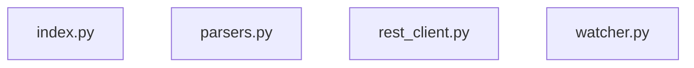

# Architecture

## Module map

## Module reference

| Module | Purpose |
|:---|:---|
| `index.py` | TTL-cached vault index |
| `parsers.py` | Vault parsing helpers — canonical home |
| `rest_client.py` | HTTP client for the Obsidian Local REST API |
| `watcher.py` | Filesystem watcher for incremental index invalidation |

## MCP server architecture

`server.py` at the project root is the MCP entry point. It exposes tools to AI assistants via the Model Context Protocol.
