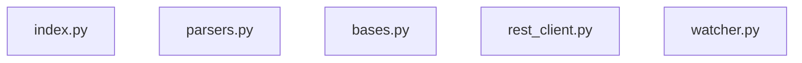

# Architecture

## Module map

## Module reference

| Module | Purpose |
|:---|:---|
| `index.py` | TTL-cached vault index |
| `parsers.py` | Vault parsing helpers — canonical home |
| `bases.py` | Obsidian Bases parser, evaluator, and execution engine |
| `rest_client.py` | HTTP client for the Obsidian Local REST API |
| `watcher.py` | Filesystem watcher for incremental index invalidation |

## MCP server architecture

`server.py` at the project root is the MCP entry point. It exposes tools to AI assistants via the Model Context Protocol.

### Bases & Formula Evaluation

The `bases.py` module implements a restricted AST-based evaluator for Obsidian-compatible formulas. 
- **Tier 1**: Simple property access and link counting.
- **Tier 2**: Logic (`if`), list-shaping (`map`, `join`), and string manipulation (`replace`, `+`).
- **Safety**: Includes regex timeouts (100ms) and nesting depth limits (10 levels) to protect the server from expensive or recursive evaluations.
